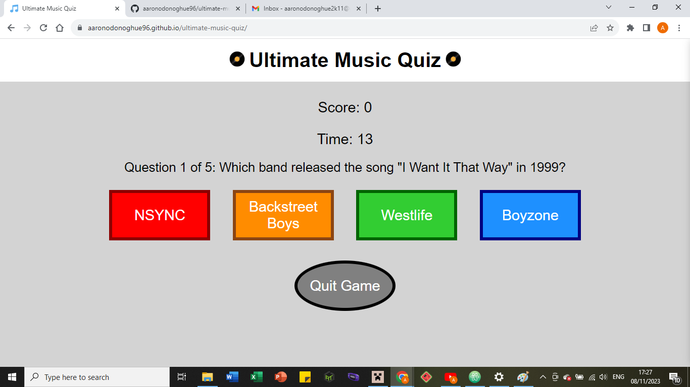

# Ultimate Music Quiz

Visit the deployed site: https://aaronodonoghue96.github.io/ultimate-music-quiz/

Music is known as the universal language, and it is a form of entertainment that has been with us for centuries, and is found in all corners of the world. Music has been available in a variety of different recorded forms throughout the ages, from records to cassettes to CDs to digital formats like mp3 files. According to [Headphones Addict](https://headphonesaddict.com/listening-to-music-statistics/), roughly 7.11 billion people in the world listen to music, the average person will hear 1.3 million songs in their lifetime, and listens to 961 hours and 10 minutes of music a year, which is equivalent to slightly over 40 days straight of listening to music!

This quiz was designed for lovers of music to test their knowledge, with questions covering a wide array of genres, eras of music, and artists. My love for music and quizzes, the wide variety, long history, and universality of music, as well as playing several music-related quizzes, such as the video game "Buzz! The Music Quiz" for the PlayStation 2, all came together to give me the idea to make a music quiz of my own using JavaScript, HTML and CSS.

## Features:

The website has just a single page, which is responsive, and has a favicon, a logo which is made up of the title with an image of vinyl record on either side, and the game area, whose contents change depending on where the player is in the quiz.

### Favicon:

- The favicon displayed in the browser tab.

### Logo:

- The logo for the quiz, consisting of the title surrounded by two vinyl records.

### Game Area:

- Main Menu
  - At the main menu, where the player lands upon first opening the website, the game area contains just a welcome message, the Play buttons, and four buttons for selecting the length of the quiz.

- Asking a Question
  - When a question is posed to the user, the game area will display the question, the current score, the timer (which updates every second after the question is asked until reaching 0), four answer buttons with possible answers to the question, each in a different colour, and the Quit Game button which will take you back to the main menu.

- Feedback on Answer
  - When the user is given feedback on whether their answer is right or wrong (or if they ran out of time), the game area will display a message to indicate if the answer is right, wrong, or if the user was out of time, as well as the Next button to advance to the next question, and the Quit Game button to return to the main menu.

- End of Game
  - When the game is over, the user is shown their final score, a message to thank them for playing the game, and the Play button (which now says "Play Again"), which will restart a new game of the same length, and the Quit Game button, which will return the user to the main menu.

### Quiz Length Selection Options:

- The quiz length selection options, with images of each of the four options selected.

### Play Button:

- The Play button, used to start the game with the length chosen in the quiz length selection.

### Score:

- The score display, used to keep track of the player's score from correct answers, based on how quickly they gave each correct answer.

### Timer:

- The timer for the quiz, which is set to 15 seconds at the start of each new question, used to determine how many points the player gets for a correct answer based on how much time remains after it is selected.
- If this reaches 0, the player is out of time and cannot answer the question, and is taken to the feedback screen where they are told they are out of time, given the correct answer, and the options to proceed or quit.

### Answer Buttons:

- The answer buttons for the quiz, which are populated at the start of each question with the four possible answers for that question. Once one of these is selected, the timer will stop, and the feedback screen will appear to tell the player if their answer is correct or incorrect, and give them the options to proceed or quit.

### Quit Game Button:

### Feedback:

### Next Button:

### Play Again Button:

- The Play Again variant of the Play button found at the end screen, used to start a new game of the same length as the one just completed.

## Technologies Used:

- Languages used:
  - JavaScript
  - HTML
  - CSS

- Other technologies used:
  - Git: version control
  - GitHub: store files and committed changes
  - Google Developer Tools: check responsiveness and display on different device sizes
  - Favicon.io: create favicon for website
  - Am I Responsive?: display website on different device types
  - GitHub Pages: deployment

## Deployment:

This site is deployed using GitHub Pages - [Ultimate Music Quiz](https://aaronodonoghue96.github.io/ultimate-music-quiz/)

To deploy the site to GitHub Pages:
- Login to GitHub.
- Go to the project repository aaronodonoghue96/ultimate-music-quiz.
- Click on the Settings button.
- Select the Pages option in the vertical menu on the left.
- Select "main" as the branch from the source dropdown menu.
- Click Save.
- The site is now deployed.

## Local Development:

### Forking:

To fork this repository:
- Login to GitHub.
- Go to the project repository aaronodonoghue96/ultimate-music-quiz.
- Click the Fork button in the top right corner.
- You have now forked the repository.

### Cloning:

To clone this repository:
- Login to GitHub.
- Go to the project repository aaronodonoghue96/ultimate-music-quiz.
- Click on the green Code button, and under the Local tab, select either HTTPS, SSH or GitHub CLI, and copy the URL displayed.
- Open a terminal, navigate to the directory you want to place the repository into, and type 'git clone', then paste the URL you just copied, and press Enter.
- You have now cloned the repository.

## Testing:

### Automated Testing:

- W3C was used to validate both the HTML and CSS on the website. Both passed with no errors or warnings.
- jshint was used to validate the JavaScript. It passed with no errors and only one warning: Functions declared within loops referencing an outer scoped variable may lead to confusing semantics. This was used to add event listeners to all answer buttons.
- Lighthouse was used to assess the performance, accessibility, best practices, and SEO of the website. The accessibility and best practices both scored 100 while performance and SEO both scored 92. The results can be seen in the image below:

### Manual Testing:

This website was tested on a wide variety of mobiles, tablets and desktops using Google Developer Tools. On all the devices I tested, I ensured the text was visible in all cases, that the buttons and text were the right size so that the text would fit inside the buttons, that the answer buttons fit on the screen in either a line of 4 or a 2x2 grid, with the Quit Game button below, and that the entire game is visible without the need to scroll.

The devices I tested on using Google Developer Tools were:
- iPhone SE
- iPhone XR
- iPhone 12 Pro
- iPhone 14 Pro Max
- Pixel 7
- Samsung Galaxy 8+
- Samsung Galaxy S20 Ultra
- iPad Mini
- iPad Air
- iPad Pro
- Surface Pro 7
- Surface Duo
- Galaxy Fold
- Samsung Galaxy A51/71
- Nest Hub
- Nest Hub Max

I also tested to make sure the following features worked correctly:
- Clicking the Play button on the main menu will start the game on Question 1, with a score of 0, the timer set to 15 seconds, and exactly one timer active.
- Clicking any of the quiz length selection buttons will set the quiz to the specified length, either 5, 10, 15 or 20, upon pressing Play.
- The score is set to 0 at the beginning of each new game, and is only increased if the player answers correctly.
- The amount of points awarded is equal to how many seconds are left on the timer when the answer was given.
- The score updates after every correct answer, and displays the total points earned so far.
- The timer stops when any answer is selected or the Quit Game button is clicked.
- There is no way to give an answer outside of the four possible answers supplied for each question.
- There is a maximum of one timer active at any given time.
- The timer value will never be greater than 15 or less than 0.
- The timer counts down by 1 once every second.
- If the timer reaches zero, it stops. The player cannot answer the question, is awarded no points, and is given feedback to indicate that they are out of time, and what the correct answer for that question was.
- If the correct answer is selected, the score is updated to include the points earned for that question, and the player is given feedback to indicate their answer is correct.
- If an incorrect answer is selected, no points are awarded, and the player is given feedback to indicate their answer is incorrect, and what the correct answer for that question was.
- Points are never deducted from the total while the quiz is active.
- The Quit Game button takes the player back to the main menu, exiting the quiz and resetting the timer, score and question number, and allowing the user to start a new quiz from scratch and choose its length.
- The Next button advances the player to the next question, increases the question number by 1, displays a new question with a new set of possible answers, and resets the timer to 15 seconds.
- If the last question has just been answered, the Next button will instead take the player to the end screen.
- The end screen displays the player's final score, a message to thank them for playing, the Play button with the text "Play Again", and the Quit Game button.
- The final score will never be greater than 15 times the chosen quiz length, i.e. 75 for 5 questions, 150 for 10 questions, 225 for 15 questions, or 300 for 20 questions, and will never be less than 0.
- Choosing Play Again will start a new quiz of the same length from scratch, with a score of 0, the timer reset to 15 seconds, and back to Question 1.
- Choosing Quit Game will return the player to the main menu.

## Fixed Bugs:
- Adding 'event' to function (i.e. 'e => function(event)') in loop for adding event listeners to answer buttons caused checkAnswer() not to be called. This has been fixed by removing that piece of code and leaving both functions without parameters.
- Score was not being updated after last question. This has been fixed by getting the DOM element with the id "score" and updating it.
- Wrong answers were being treated as invalid because the "in" keyword was used to check for list membership, rather than the includes() method. This has been fixed by updating the check to use the includes() method instead of "in".

## Credits:
- The image of a record used in the quiz logo was taken from the following link: https://www.vecteezy.com/png/9313617-vinyl-record-vector-illustration-isolated-on-white-background [Vinyl Record PNGs by Vecteezy](https://www.vecteezy.com/free-png/vinyl-record), is under the Free License, and was created by Ovidiu Timplaru.
- The favicon of a music note used in this website is from [favicon.io](https://favicon.io/emoji-favicons/musical-note), and is distributed under the [Creative Commons BY 4.0 license](https://creativecommons.org/licenses/by/4.0/). No changes were made to the favicon files in this project.
- All other code in this project is my own original work.
